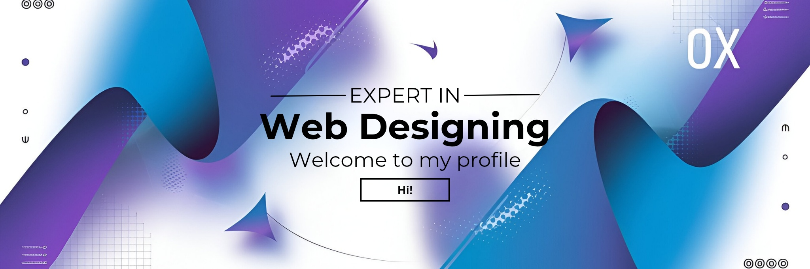

  

   
  
  # Hi, I'm Web-Dev-Rohan 👋
  
  

  
  # 💫 About Me:
🔭 Currently working on: High-quality web apps, portfolios, and automation workflows 👯 Open to collaborate on: Frontend, UI/UX-focused, and SaaS-style projects 🤝 Looking for help with: DevOps best practices and system scaling 🌱 Currently learning: Advanced DevOps, performance, and system design 💬 Ask me about: React, TypeScript, HTML, CSS, Tailwind, prompt engineering, and automation ⚡ Fun fact: I ship faster than most people finish planning 😄

# 🏆 My GitHub Trophies:

# 💻 Tech Stack:
                                                         
# 📊 GitHub Stats:
 
 

## 🐍 Snake

---

<!-- Proudly created with GPRM ( https://gprm.itsvg.in ) -->
